# Exercise - 7

## Diagrama de clases

```mermaid
classDiagram
    %% --- Jerarquía de Identidades ---
    class Identity {
        <<abstract>>
        +getDailyLimit() double
        +isAllowed(OperationType type) boolean
        +validateExtraRules(BankOperation op, LocalDate date) void
    }
    class PersonalIdentity
    class BusinessIdentity
    class MinorIdentity
    class ForeignResidentIdentity

    Identity <|-- PersonalIdentity
    Identity <|-- BusinessIdentity
    Identity <|-- MinorIdentity
    Identity <|-- ForeignResidentIdentity

    %% --- Jerarquía de Operaciones ---
    class BankOperation {
        <<abstract>>
        +OperationType type
        +double amount
        +getAmountAgainstLimit() double
    }
    class Deposit {
        +getAmountAgainstLimit() double
    }
    class Payroll {
        -List~String~ employees
        +getAmountAgainstLimit() double
    }
    class StandardTransfer {
        +getAmountAgainstLimit() double
    }

    BankOperation <|-- Deposit
    BankOperation <|-- Payroll
    BankOperation <|-- StandardTransfer

    %% --- Patrón Adapter para Processors ---
    class Processor {
        <<interface>>
        +supports(OperationType type) boolean
        +calculateFee(BankOperation op) double
        +process(BankOperation op) OperationResult
    }

    class NationalBankAdapter {
        -NationalBankAPI api
        +process(BankOperation op) OperationResult
    }
    class PacificBankAdapter {
        -PacificBankAPI api
        +process(BankOperation op) OperationResult
    }
    class SwiftGatewayAdapter {
        -SwiftAPI api
        +process(BankOperation op) OperationResult
    }

    Processor <|.. NationalBankAdapter
    Processor <|.. PacificBankAdapter
    Processor <|.. SwiftGatewayAdapter

    %% --- APIs Externas (No modificables) ---
    class NationalBankAPI {
        <<External SDK>>
        +postTransaction(String ref, String acc, double amt) String
    }
    class PacificBankAPI {
        <<External SDK>>
        +submit(String acc, String dest, long cents, String desc) String
        +submitPayroll(String acc, List~String~ dests, long cents) String
    }
    class SwiftAPI {
        <<External SDK>>
        +sendWire(String sender, String bic, String acc, double amt, String curr) String
    }

    NationalBankAdapter --> NationalBankAPI : envuelve (wraps)
    PacificBankAdapter --> PacificBankAPI : envuelve (wraps)
    SwiftGatewayAdapter --> SwiftAPI : envuelve (wraps)

    %% --- Servicio Orquestador ---
    class BankingService {
        -List~Processor~ processors
        +execute(Identity id, BankOperation op) OperationResult
    }

    BankingService --> Identity : usa
    BankingService --> BankOperation : usa
    BankingService --> Processor : usa
```



## Diagrama renderizado


## Explicación de la solución

El rediseño del sistema elimina el código espagueti centralizado en la clase `BankingService` mediante la distribución de responsabilidades usando **herencia** y **polimorfismo**.

En lugar de que el servicio orquestador evalúe constantemente qué tipo de identidad, operación o procesador está manejando mediante condicionales `if`/`switch`, las propias clases asumen el control de su comportamiento.

---

### 1. Herencia: clasificación y especialización

La herencia se utiliza para definir contratos comunes (clases abstractas o interfaces) y permitir que clases más específicas adopten y extiendan esos comportamientos.

En el diseño original, una única entidad contenía campos innecesarios para ciertos tipos, como un campo `guardian` en una identidad de negocios.

#### Identidades

- Se define una clase base abstracta `Identity` con los métodos fundamentales.
- Las subclases heredan esta estructura y definen únicamente los atributos que les corresponden:
  - `PersonalIdentity`
  - `BusinessIdentity`: incluye `Tax ID` y nombre de la empresa.
  - `MinorIdentity`: incluye al guardián.
  - `ForeignResidentIdentity`

#### Operaciones

- Se crea una clase base `BankOperation` que agrupa el tipo y el monto.
- Subclases como `Deposit`, `Payroll` y `StandardTransfer` heredan esta base.
- Cada subclase se especializa en cómo calcula su impacto en los límites diarios.

---

### 2. Polimorfismo: comportamiento dinámico sin condicionales

El polimorfismo permite que `BankingService` trate a todos los objetos a través de sus clases base o interfaces, sin importarle la implementación específica subyacente.

La decisión de qué código ejecutar se toma dinámicamente en tiempo de ejecución.

#### Polimorfismo de identidades

Cuando el servicio necesita validar si un límite ha sido superado, simplemente llama a:

```java
identity.getDailyLimit()
```

- Si el objeto en memoria es `MinorIdentity`, devolverá `100` automáticamente.
- Si es `BusinessIdentity`, devolverá `50,000`.

El servicio no necesita preguntar qué tipo de identidad es.

Lo mismo ocurre con `identity.validateExtraRules()`:

- `ForeignResidentIdentity` verifica la fecha de expiración de residencia.
- `BusinessIdentity` valida el código de aprobación para operaciones mayores a `10,000`.

#### Polimorfismo de operaciones

Para saber cuánto afecta una transacción al límite diario, el servicio llama a:

```java
operation.getAmountAgainstLimit()
```

Gracias al polimorfismo:

- Si la operación es `Deposit`, el método sobreescrito devolverá `0`.
- Si es `Payroll`, devolverá el monto multiplicado por el número de empleados.

El orquestador suma este valor ciegamente, confiando en que la operación se calculó a sí misma correctamente.

#### Polimorfismo de procesadores (interfaces)

El servicio maneja una lista de objetos tipo `Processor`, la interfaz unificada.

Al ejecutar:

```java
processor.process(operation)
```

El polimorfismo garantiza que el adaptador correcto ejecute su lógica:

- `NationalBankAdapter`: maneja respuestas nulas internamente.
- `PacificBankAdapter`: convierte los montos a centavos y analiza el texto de rechazo.

`BankingService` solo recibe un `OperationResult` estándar.

---

## Beneficios del rediseño

| Problema anterior | Solución aplicada |
|---|---|
| Condicionales `if`/`switch` centralizados | Polimorfismo |
| Clase única con campos innecesarios | Herencia y especialización |
| Lógica de APIs externas dispersa | Patrón Adapter con interfaz `Processor` |
| Acoplamiento fuerte a bancos específicos | Adaptadores + `OperationResult` estándar |  
